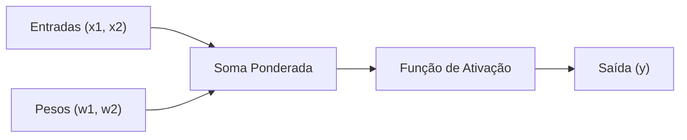

[English](docs/README.en.md) | **Português** | [简体中文](docs/README.zh-CN.md)

# Implementação de Rede Neural Perceptron

Uma implementação educacional de Perceptron em Python puro para compreender os fundamentos das redes neurais artificiais.

---

## Sumário

- [Sobre o Projeto](#sobre-o-projeto)
  - [Características Principais](#características-principais)
  - [Aplicações Práticas](#aplicações-práticas)
- [Tecnologias Utilizadas](#tecnologias-utilizadas)
- [Resultados Obtidos](#resultados-obtidos)
  - [Métricas de Desempenho](#métricas-de-desempenho)
  - [Evolução do Treinamento](#evolução-do-treinamento)
- [Como Executar](#como-executar)
  - [Pré-requisitos](#pré-requisitos)
  - [Executando o Projeto](#executando-o-projeto)
- [Conceitos Fundamentais](#conceitos-fundamentais)
  - [O que é um Perceptron?](#o-que-é-um-perceptron)
  - [Processo de Funcionamento](#processo-de-funcionamento)
- [Processo de Treinamento](#processo-de-treinamento)
  - [Dados de Treinamento](#dados-de-treinamento)
  - [Parâmetros do Modelo](#parâmetros-do-modelo)
  - [Algoritmo de Treinamento](#algoritmo-de-treinamento)
- [Fórmulas Matemáticas](#fórmulas-matemáticas)
  - [Combinação Linear](#combinação-linear)
  - [Função de Ativação (Degrau)](#função-de-ativação-degrau)
  - [Regra Delta (Ajuste de Pesos)](#regra-delta-ajuste-de-pesos)
- [Estrutura do Projeto](#estrutura-do-projeto)
  - [Descrição dos Arquivos](#descrição-dos-arquivos)
- [Aprendizados](#aprendizados)
  - [O que Funciona Bem](#o-que-funciona-bem)
  - [Limitações Identificadas](#limitações-identificadas)
  - [Insights dos Pesos Finais](#insights-dos-pesos-finais)
- [Contribuição](#contribuição)
  - [Ideias para Contribuição](#ideias-para-contribuição)
- [Licença](#licença)
- [Autor](#autor)

---

## Sobre o Projeto

Este projeto implementa um Perceptron do zero em Python, sem o uso de bibliotecas externas de machine learning, com o objetivo de solidificar o entendimento sobre redes neurais artificiais e algoritmos de aprendizado de máquina.

### Características Principais

- **Implementação Pura**: Código Python sem dependências externas de aprendizado de máquina.
- **Fins Educacionais**: Explicações conceituais detalhadas a cada etapa.
- **Visualização Detalhada**: Acompanhamento do processo de treinamento época por época.
- **Convergência Garantida**: Convergência para erro zero em conjuntos de dados linearmente separáveis.

### Aplicações Práticas

O Perceptron pode ser aplicado conceitualmente em diversos cenários:

- **Comércio Eletrônico (E-commerce)**: Classificação de produtos com potencial de alta demanda.
- **Marketing**: Identificação e segmentação de potenciais compradores.
- **Sistemas de Recomendação**: Classificação preliminar de preferências de usuários.
- **Logística**: Estimativas de faixas de entrega com base em variáveis lineares.
- **Segurança da Informação**: Detecção inicial de padrões em atividades suspeitas.

---

## Tecnologias Utilizadas

| Tecnologia | Versão | Finalidade |
|------------|--------|------------|
| Python | 3.7+ | Linguagem de programação principal |
| Jupyter Notebook | Recente | Ambiente para execução interativa e documentação |
| Markdown | - | Formatação da documentação |

---

## Resultados Obtidos

### Métricas de Desempenho

| Métrica | Valor |
|---------|-------|
| Épocas até a Convergência | 12 |
| Taxa de Aprendizagem | 0.1 |
| Erro Final | 0 (Zero) |
| Peso Final W1 | 0.23 |
| Peso Final W2 | -0.14 |

### Evolução do Treinamento

```text
Época  1: Erros = 1  | W1 = 0.20, W2 = -0.10
Época  2: Erros = 2  | W1 = 0.18, W2 = -0.14
...
Época 12: Erros = 0  | W1 = 0.23, W2 = -0.14 (Convergência atingida)
```

> **Resultado**: O modelo convergiu com erro zero na 12ª época, demonstrando eficácia na separação de classes linearmente separáveis.

---

## Como Executar

### Pré-requisitos

Certifique-se de possuir o Python 3.7 ou superior instalado no seu sistema.

```bash
# Verificar a versão instalada do Python
python --version

# Instalar o Jupyter Notebook (caso necessário)
pip install jupyter
```

### Executando o Projeto

1. **Clone o repositório:**
   ```bash
   git clone https://github.com/renatoobarros/perceptron.git
   cd perceptron
   ```

2. **Inicie o Jupyter Notebook com o arquivo em Português:**
   ```bash
   jupyter notebook notebooks/perceptron.ipynb
   ```

3. **Ou utilize o Jupyter Lab:**
   ```bash
   jupyter lab notebooks/perceptron.ipynb
   ```

---

## Conceitos Fundamentais

### O que é um Perceptron?

O Perceptron é o modelo mais elementar de rede neural artificial com aprendizado supervisionado, inspirado no neurônio biológico. Ele processa informações por meio de combinação linear e aplicação de função de ativação:



### Processo de Funcionamento

| Etapa | Descrição | Equação |
|-------|-----------|---------|
| 1. Combinação Linear | Multiplica cada entrada pelo seu respectivo peso e soma | `u = (x1 * w1) + (x2 * w2)` |
| 2. Função de Ativação | Aplica a função degrau para determinar a saída binária | `y = 1 se u >= 0, senão 0` |
| 3. Ajuste de Pesos | Ajusta pesos quando a saída difere do valor desejado | `w_novo = w_atual + taxa * erro * x` |

---

## Processo de Treinamento

### Dados de Treinamento

```python
dados_treinamento = [
    {"x1": 0.5, "x2": 0.8, "saida_desejada": 1},  # Classe positiva
    {"x1": 0.2, "x2": 0.4, "saida_desejada": 0},  # Classe negativa
]
```

### Parâmetros do Modelo

| Parâmetro | Valor | Descrição |
|-----------|-------|-----------|
| Pesos Iniciais | `[0.2, -0.1]` | Valores iniciais dos pesos |
| Taxa de Aprendizagem | `0.1` | Fator de ajuste dos pesos a cada erro |
| Limite de Épocas | `20` | Número máximo de iterações permitidas |

### Algoritmo de Treinamento

```python
for epoca in range(limite_epocas):
    erro_na_epoca = False
    for dado in dados_treinamento:
        # 1. Calcular saida
        u = dado["x1"] * w1 + dado["x2"] * w2
        saida = 1 if u >= 0 else 0
        
        # 2. Calcular erro
        erro = dado["saida_desejada"] - saida
        
        # 3. Ajustar pesos (se necessario)
        if erro != 0:
            w1 += taxa_aprendizagem * erro * dado["x1"]
            w2 += taxa_aprendizagem * erro * dado["x2"]
            erro_na_epoca = True
    
    # 4. Verificar convergencia
    if not erro_na_epoca:
        print(f"Convergiu na epoca {epoca}!")
        break
```

---

## Fórmulas Matemáticas

### Combinação Linear

```text
u = sum(xi * wi) = x1 * w1 + x2 * w2
```

### Função de Ativação (Degrau)

```text
f(u) = {
    1, se u >= 0
    0, se u < 0
}
```

### Regra Delta (Ajuste de Pesos)

```text
wi(novo) = wi(atual) + eta * erro * xi
```

**Onde:**
- `eta`: Taxa de aprendizagem
- `erro`: `saida_desejada - saida_predita`
- `xi`: Valor da entrada `i`

---

## Estrutura do Projeto

```text
perceptron/
├── docs/
│   ├── licenses/
│   │   ├── LICENSE.pt-BR       # Tradução da licença GNU GPL v3.0 para Português do Brasil
│   │   └── LICENSE.zh-CN       # Tradução da licença GNU GPL v3.0 para Chinês Simplificado
│   ├── README.en.md            # Documentação em Inglês
│   └── README.zh-CN.md         # Documentação em Chinês Simplificado
├── notebooks/
│   ├── perceptron.en.ipynb     # Notebook com implementação em Inglês
│   ├── perceptron.ipynb        # Notebook com implementação em Português
│   └── perceptron.zh-CN.ipynb  # Notebook com implementação em Chinês Simplificado
├── LICENSE                     # Texto oficial da licença GNU GPL v3.0 em Inglês
└── README.md                   # Documentação principal em Português
```

### Descrição dos Arquivos

| Arquivo | Descrição |
|---------|-----------|
| [`notebooks/perceptron.en.ipynb`](notebooks/perceptron.en.ipynb) | Jupyter Notebook com explicações e anotações em Inglês |
| [`notebooks/perceptron.ipynb`](notebooks/perceptron.ipynb) | Jupyter Notebook contendo a implementação passo a passo em Português |
| [`notebooks/perceptron.zh-CN.ipynb`](notebooks/perceptron.zh-CN.ipynb) | Jupyter Notebook com explicações e anotações em Chinês Simplificado |
| [`docs/README.en.md`](docs/README.en.md) | Documentação do projeto em Inglês |
| [`README.md`](README.md) | Documentação principal do projeto em Português |
| [`docs/README.zh-CN.md`](docs/README.zh-CN.md) | Documentação do projeto em Chinês Simplificado |
| [`LICENSE`](LICENSE) | Texto oficial da licença GNU General Public License v3.0 em Inglês |
| [`docs/licenses/LICENSE.pt-BR`](docs/licenses/LICENSE.pt-BR) | Tradução de referência da licença GNU GPL v3.0 para Português do Brasil |
| [`docs/licenses/LICENSE.zh-CN`](docs/licenses/LICENSE.zh-CN) | Tradução de referência da licença GNU GPL v3.0 para Chinês Simplificado |

---

## Aprendizados

### O que Funciona Bem

- **Dados Linearmente Separáveis**: O Perceptron garante convergência matemática quando as classes são linearmente separáveis.
- **Implementação Direta**: Estrutura lógica simples, ideal para fins didáticos.
- **Interpretabilidade**: O sinal e magnitude dos pesos indicam diretamente a relevância de cada atributo.

### Limitações Identificadas

- **Problemas Não Lineares**: Incapacidade de resolver problemas com fronteiras não lineares (como o problema XOR).
- **Classificação Binária**: Adequado nativamente apenas para problemas de duas classes.
- **Sensibilidade à Inicialização**: O tempo de convergência varia de acordo com a taxa de aprendizagem e os pesos iniciais.

### Insights dos Pesos Finais

| Peso | Valor | Interpretação |
|------|-------|---------------|
| W1 | `+0.23` | Influência positiva: valores maiores favorecem a classe 1 |
| W2 | `-0.14` | Influência negativa: valores maiores favorecem a classe 0 |

---

## Contribuição

Contribuições são bem-vindas para melhorias conceituais e novos experimentos.

1. Faça um Fork do projeto
2. Crie uma branch para sua modificação (`git checkout -b feature/minha-melhoria`)
3. Faça o commit de suas alterações (`git commit -m 'Adiciona melhoria X'`)
4. Envie para o branch remoto (`git push origin feature/minha-melhoria`)
5. Abra um Pull Request

### Ideias para Contribuição

- Adicionar visualizações gráficas do plano de decisão durante o treinamento.
- Implementar e comparar outras funções de ativação (como Sigmoide ou ReLU).
- Incluir métricas adicionais de avaliação (como matriz de confusão e acurácia).
- Testar com conjuntos de dados sintéticos adicionais.

---

## Licença

Este projeto está licenciado sob os termos da **GNU General Public License v3.0 ou posterior (GPL-3.0-or-later / GPL v3+)**.

- Para o texto legal oficial com validade jurídica, consulte o arquivo [`LICENSE`](LICENSE) (em Inglês).
- Para fins de consulta e entendimento em Português, veja a tradução de referência em [`docs/licenses/LICENSE.pt-BR`](docs/licenses/LICENSE.pt-BR).

---

## Autor

Desenvolvido por Renato Barros.

> "A jornada de mil quilômetros começa com um único passo." — Lao Tzu
