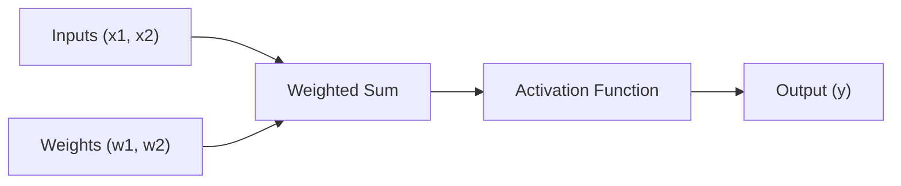

# Perceptron Neural Network Implementation

**An educational pure Python implementation to understand the fundamentals of artificial neural networks and machine learning algorithms.**

**English** · [Português do Brasil](../README.md) · [简体中文](README.zh-CN.md)

You can explore and run the complete implementation directly in the notebook [`notebooks/perceptron.en.ipynb`](../notebooks/perceptron.en.ipynb) or follow the walkthrough and analysis below.

## About the Project

This project implements a Perceptron from scratch in Python without external machine learning libraries, aiming to provide a solid grasp of artificial neural networks and foundational machine learning algorithms.

### Key Features

- **Pure Implementation**: Standard Python code with zero external machine learning dependencies.
- **Educational Focus**: Detailed step-by-step conceptual explanations.
- **Granular Visualization**: Epoch-by-epoch tracking of the learning process and weight updates.
- **Guaranteed Convergence**: Demonstrates guaranteed zero-error convergence on linearly separable data.

### Practical Applications

Conceptually, the Perceptron algorithm can be applied to various real-world scenarios:

- **E-Commerce**: Initial classification of high-demand items based on transactional features.
- **Marketing**: Lead qualification and potential buyer segmentation.
- **Recommendation Systems**: Basic preference classification filters.
- **Logistics**: Simple delivery bracket estimation based on linear factors.
- **Information Security**: Preliminary pattern detection for suspicious activity.

## Technologies Used

| Technology | Version | Purpose |
|------------|---------|---------|
| Python | 3.7+ | Core programming language |
| Jupyter Notebook | Recent | Interactive development and documentation environment |
| Markdown | - | Documentation formatting |

## Experimental Results

### Performance Metrics

| Metric | Value |
|--------|-------|
| Epochs to Convergence | 12 |
| Learning Rate | 0.1 |
| Final Error | 0 (Zero) |
| Final Weight W1 | 0.23 |
| Final Weight W2 | -0.14 |

### Training Progress

```text
Epoch  1: Errors = 1  | W1 = 0.20, W2 = -0.10
Epoch  2: Errors = 2  | W1 = 0.18, W2 = -0.14
...
Epoch 12: Errors = 0  | W1 = 0.23, W2 = -0.14 (Convergence reached)
```

The model converged with zero errors at epoch 12, demonstrating full separation of the linearly separable dataset.

## How to Run

### Prerequisites

Ensure you have Python 3.7 or higher installed on your system.

```bash
# Check Python installation
python --version

# Install Jupyter Notebook (if not already installed)
pip install jupyter
```

### Running the Project

1. **Clone the repository:**
   ```bash
   git clone https://github.com/renatoobarros/perceptron.git
   cd perceptron
   ```

2. **Launch Jupyter Notebook:**
   ```bash
   jupyter notebook notebooks/perceptron.en.ipynb
   ```

3. **Or launch using Jupyter Lab:**
   ```bash
   jupyter lab notebooks/perceptron.en.ipynb
   ```

## Fundamental Concepts

The Perceptron is the simplest model of a supervised artificial neural network, inspired by biological neurons. It processes input signals through linear weighting followed by a threshold activation function:



### Operational Workflow

| Step | Description | Formulation |
|------|-------------|-------------|
| 1. Linear Combination | Multiplies inputs by their corresponding weights and computes the sum | `u = (x1 * w1) + (x2 * w2)` |
| 2. Activation Function | Applies the Heaviside step function for binary output | `y = 1 if u >= 0 else 0` |
| 3. Weight Adjustment | Updates weights whenever the predicted output deviates from the target | `w_new = w_current + rate * error * x` |

## Training Process

### Training Data

```python
dados_treinamento = [
    {"x1": 0.5, "x2": 0.8, "saida_desejada": 1},  # Positive class
    {"x1": 0.2, "x2": 0.4, "saida_desejada": 0},  # Negative class
]
```

### Model Parameters

| Parameter | Value | Description |
|-----------|-------|-------------|
| Initial Weights | `[0.2, -0.1]` | Starting weight vector |
| Learning Rate | `0.1` | Step size scaling factor per weight update |
| Max Epochs | `20` | Maximum number of iterations allowed |

### Training Algorithm

```python
for epoca in range(limite_epocas):
    erro_na_epoca = False
    for dado in dados_treinamento:
        # 1. Compute output
        u = dado["x1"] * w1 + dado["x2"] * w2
        saida = 1 if u >= 0 else 0
        
        # 2. Compute error
        erro = dado["saida_desejada"] - saida
        
        # 3. Update weights (if necessary)
        if erro != 0:
            w1 += taxa_aprendizagem * erro * dado["x1"]
            w2 += taxa_aprendizagem * erro * dado["x2"]
            erro_na_epoca = True
    
    # 4. Check convergence
    if not erro_na_epoca:
        print(f"Converged at epoch {epoca}!")
        break
```

## Mathematical Formulations

### Linear Combination

```text
u = sum(xi * wi) = x1 * w1 + x2 * w2
```

### Activation Function (Step Function)

```text
f(u) = {
    1, if u >= 0
    0, if u < 0
}
```

### Delta Rule (Weight Updates)

```text
wi(new) = wi(current) + eta * error * xi
```

**Where:**
- `eta`: Learning rate
- `error`: `target_output - predicted_output`
- `xi`: Input value for feature `i`

## Key Insights and Takeaways

### Strengths

- **Linearly Separable Data**: The Perceptron Convergence Theorem guarantees finding a separating hyperplane if one exists.
- **Simplicity**: Clear mathematical logic that forms the foundation of deeper feedforward networks.
- **Interpretability**: Sign and magnitude of final weights clearly indicate feature contributions.

### Identified Limitations

- **Non-Linear Problems**: Cannot solve non-linearly separable problems (such as XOR).
- **Binary Scope**: Natively designed for two-class classification tasks.
- **Sensitivity**: Number of epochs to convergence depends on initialization and learning rate choice.

### Final Weight Insights

| Weight | Value | Interpretation |
|--------|-------|----------------|
| W1 | `+0.23` | Positive impact: larger values increase probability of class 1 |
| W2 | `-0.14` | Negative impact: larger values increase probability of class 0 |

## License

This project is licensed under the terms of the GNU General Public License v3.0 or later (GPL-3.0-or-later). See the [`LICENSE`](../LICENSE) file for details.

## Contact

Renato Barros — [falecom@renatobarros.dev.br](mailto:falecom@renatobarros.dev.br)
