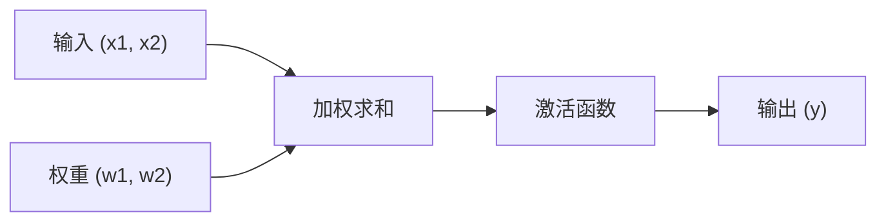

# 感知机（Perceptron）神经网络实现

基于纯 Python 实现的教学项目，旨在帮助理解人工神经网络与机器学习算法的基本原理。

[English](README.en.md) · [Português](../README.md) · 简体中文

您可以直接在 Notebook [`notebooks/perceptron.zh-CN.ipynb`](../notebooks/perceptron.zh-CN.ipynb) 中探索并运行完整实现，或阅读以下解析与实验分析。

## 关于项目

本项目使用纯 Python 从零实现了感知机（Perceptron）模型，不依赖任何外部机器学习库，旨在巩固对人工神经网络的理解。

## 核心特性

- **纯 Python 实现**：无外部依赖的 Python 代码。
- **教学导向**：每个步骤均附带详细的概念性解释。
- **过程可视化**：逐轮（Epoch）跟踪训练过程。
- **收敛保证**：对线性可分数据实现零误差收敛的数学证明。

## 实际应用场景

在概念层面上，感知机算法可应用于以下多种场景：

- **电子商务**：对高需求潜力商品进行分类。
- **市场营销**：识别并细分潜在买家。
- **推荐系统**：对用户偏好进行初步分类。
- **物流规划**：基于线性变量估算配送时间区间。
- **信息安全**：对可疑活动中的模式进行初步检测。

## 所用技术

| 技术             | 版本   | 用途                 |
| ---------------- | ------ | -------------------- |
| Python           | 3.7+   | 主要编程语言         |
| Jupyter Notebook | 最新版 | 交互式运行与文档环境 |
| Markdown         | -      | 文档排版             |

## 实验结果

### 性能指标

| 指标                   | 数值        |
| ---------------------- | ----------- |
| 收敛所需轮数（Epochs） | 12          |
| 学习率                 | 0.1         |
| 最终误差               | 0（零误差） |
| 最终权重 W1            | 0.23        |
| 最终权重 W2            | -0.14       |

### 训练过程演进

```

第 1 轮: 误差数 = 1 | W1 = 0.20, W2 = -0.10
第 2 轮: 误差数 = 2 | W1 = 0.18, W2 = -0.14
...
第 12 轮: 误差数 = 0 | W1 = 0.23, W2 = -0.14 (达到收敛)

```

模型在第 12 轮以零误差收敛，验证了其对线性可分类别的有效划分。

## 如何运行

### 环境要求

请确保本地系统已安装 Python 3.7 或更高版本。

```bash
# 检查已安装的 Python 版本
python --version

# 安装 Jupyter Notebook（如有需要）
pip install jupyter
```

### 运行步骤

克隆代码仓库：

```bash
git clone https://github.com/renatoobarros/perceptron.git
cd perceptron
```

启动 Jupyter Notebook：

```bash
jupyter notebook notebooks/perceptron.zh-CN.ipynb
```

或使用 Jupyter Lab：

```bash
jupyter lab notebooks/perceptron.zh-CN.ipynb
```

## 核心概念

感知机是最基本的人工神经网络监督学习模型，其灵感来源于生物神经元。它通过线性组合与激活函数处理信息：



### 工作流程

| 步骤        | 说明                           | 公式                                 |
| ----------- | ------------------------------ | ------------------------------------ |
| 1. 线性组合 | 将每个输入乘以其对应权重后求和 | `u = (x1 * w1) + (x2 * w2)`          |
| 2. 激活函数 | 应用阶跃函数确定二值输出       | `y = 1 若 u >= 0，否则 0`            |
| 3. 权重调整 | 当输出与期望值不一致时调整权重 | `w_novo = w_atual + taxa * erro * x` |

## 训练过程

### 训练数据

```python
dados_treinamento = [
    {"x1": 0.5, "x2": 0.8, "saida_desejada": 1},  # 正类
    {"x1": 0.2, "x2": 0.4, "saida_desejada": 0},  # 负类
]
```

### 模型参数

| 参数     | 数值        | 描述                     |
| -------- | ----------- | ------------------------ |
| 初始权重 | [0.2, -0.1] | 权重初始值               |
| 学习率   | 0.1         | 每次误差时的权重调整因子 |
| 最大轮数 | 20          | 允许的最大迭代次数       |

### 训练算法

```python
for epoca in range(limite_epocas):
    erro_na_epoca = False
    for dado in dados_treinamento:
        # 1. 计算输出
        u = dado["x1"] * w1 + dado["x2"] * w2
        saida = 1 if u >= 0 else 0
        # 2. 计算误差
        erro = dado["saida_desejada"] - saida
        # 3. 调整权重（如有必要）
        if erro != 0:
            w1 += taxa_aprendizagem * erro * dado["x1"]
            w2 += taxa_aprendizagem * erro * dado["x2"]
            erro_na_epoca = True
    # 4. 检查收敛
    if not erro_na_epoca:
        print(f"在第 {epoca} 轮收敛！")
        break
```

### 数学公式

**线性组合**

```
u = sum(xi * wi) = x1 * w1 + x2 * w2
```

**激活函数（阶跃函数）**

```
f(u) = {
    1, 若 u >= 0
    0, 若 u < 0
}
```

**Delta 规则（权重调整）**

```
wi(novo) = wi(atual) + eta * erro * xi
```

其中：

- `eta`：学习率
- `erro`：`期望输出 - 预测输出`
- `xi`：输入 `i` 的值

## 学习收获

### 运作良好之处

- **线性可分数据**：当类别线性可分时，感知机保证数学收敛。
- **实现简洁**：逻辑结构简单，非常适合教学目的。
- **可解释性**：权重的符号与大小直接反映每个属性的相关性。

### 已识别的局限性

- **非线性问题**：无法解决具有非线性边界的问题（如 XOR 问题）。
- **二分类**：原生仅适用于两类分类问题。
- **初始化敏感性**：收敛速度因学习率和初始权重而异。

### 最终权重洞察

| 权重 | 数值  | 解释                             |
| ---- | ----- | -------------------------------- |
| W1   | +0.23 | 正向影响：数值越大越倾向于类别 1 |
| W2   | -0.14 | 负向影响：数值越大越倾向于类别 0 |

## 许可证

本项目基于 GNU General Public License v3.0 或更高版本（GPL-3.0-or-later）开源。请参阅 [LICENSE](../LICENSE) 文件（英文官方版）或[简体中文参考翻译](licenses/LICENSE.zh-CN)。

## 联系方式

Renato Barros — [falecom@renatobarros.dev.br](mailto:falecom@renatobarros.dev.br)
