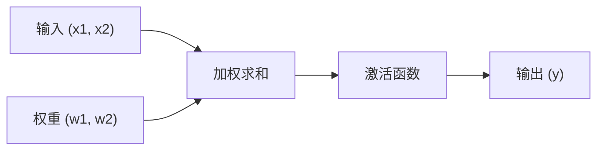

# 感知机（Perceptron）神经网络实现

**基于纯 Python 实现的感知机教学项目，旨在帮助深入理解人工神经网络与机器学习算法的基本原理。**

[English](README.en.md) · [Português do Brasil](../README.md) · **简体中文**

您可以直接在 Notebook [`notebooks/perceptron.zh-CN.ipynb`](../notebooks/perceptron.zh-CN.ipynb) 中探索并运行完整实现，或阅读以下解析与实验分析。

## 关于项目

本项目使用纯 Python 从零实现了感知机（Perceptron）模型，不依赖任何第三方机器学习框架，帮助开发者从底层机制上掌握人工神经网络与基础机器学习算法的工作原理。

### 核心特性

- **纯原生实现**：仅使用 Python 标准库，无外部机器学习依赖。
- **教学导向**：逐步拆解算法步骤，附带详细的概念与数学解释。
- **过程可视化**：逐轮（Epoch）展示训练误差变化与权重更新轨迹。
- **收敛保证**：验证在理论上保证线性可分数据集收敛至零误差。

### 实际应用场景

在概念层面上，感知机算法可应用于以下典型场景：

- **电子商务**：基于交易指标对高需求商品进行初步二分类预测。
- **市场营销**：潜在客户的资格筛选与人群细分。
- **推荐系统**：基础用户偏好过滤。
- **物流规划**：基于线性特征的时效区间预测。
- **信息安全**：异常可疑行为模式的初步筛查。

## 所用技术

| 技术 | 版本 | 用途 |
|------|------|------|
| Python | 3.7+ | 核心编程语言 |
| Jupyter Notebook | 最新版 | 交互式开发与演示环境 |
| Markdown | - | 文档排版 |

## 实验结果

### 性能指标

| 指标 | 数值 |
|------|------|
| 收敛所需轮数（Epochs） | 12 |
| 学习率（Learning Rate） | 0.1 |
| 最终误差 | 0（零误差） |
| 最终权重 W1 | 0.23 |
| 最终权重 W2 | -0.14 |

### 训练过程演进

```text
第  1 轮: 误差数 = 1 | W1 = 0.20, W2 = -0.10
第  2 轮: 误差数 = 2 | W1 = 0.18, W2 = -0.14
...
第 12 轮: 误差数 = 0 | W1 = 0.23, W2 = -0.14 (达成收敛)
```

模型在第 12 轮达到零误差收敛，成功完成了线性可分数据的分类任务。

## 如何运行

### 环境要求

请确保本地系统已安装 Python 3.7 或更高版本。

```bash
# 检查 Python 版本
python --version

# 安装 Jupyter Notebook（若尚未安装）
pip install jupyter
```

### 运行步骤

1. **克隆代码仓库：**
   ```bash
   git clone https://github.com/renatoobarros/perceptron.git
   cd perceptron
   ```

2. **启动 Jupyter Notebook：**
   ```bash
   jupyter notebook notebooks/perceptron.zh-CN.ipynb
   ```

3. **或在 Jupyter Lab 中打开：**
   ```bash
   jupyter lab notebooks/perceptron.zh-CN.ipynb
   ```

## 核心概念

感知机是受到生物神经元启发的最基本的前馈人工神经网络监督学习模型。它通过对输入信号进行线性加权求和，并通过激活函数输出二分类结果：



### 工作流程

| 步骤 | 说明 | 公式 |
|------|------|------|
| 1. 线性组合 | 将每个输入与其对应权重相乘后求和 | `u = (x1 * w1) + (x2 * w2)` |
| 2. 激活函数 | 采用单位阶跃函数映射为二进制输出 | `y = 1 (若 u >= 0) 否则 0` |
| 3. 权重更新 | 当预测输出与目标输出不一致时修正权重 | `w_new = w_current + rate * error * x` |

## 训练过程

### 训练数据

```python
dados_treinamento = [
    {"x1": 0.5, "x2": 0.8, "saida_desejada": 1},  # 正样本
    {"x1": 0.2, "x2": 0.4, "saida_desejada": 0},  # 负样本
]
```

### 模型参数

| 参数 | 设定值 | 描述 |
|------|--------|------|
| 初始权重 | `[0.2, -0.1]` | 初始权重向量 |
| 学习率 | `0.1` | 控制每次权重更新的步长 |
| 最大轮数 | `20` | 允许的最大训练迭代次数 |

### 训练算法

```python
for epoca in range(limite_epocas):
    erro_na_epoca = False
    for dado in dados_treinamento:
        # 1. 计算输出
        u = dado["x1"] * w1 + dado["x2"] * w2
        saida = 1 if u >= 0 else 0
        
        # 2. 计算误差
        erro = dado["saida_desejada"] - saida
        
        # 3. 更新权重（若有误差）
        if erro != 0:
            w1 += taxa_aprendizagem * erro * dado["x1"]
            w2 += taxa_aprendizagem * erro * dado["x2"]
            erro_na_epoca = True
    
    # 4. 检查是否收敛
    if not erro_na_epoca:
        print(f"在第 {epoca} 轮达成收敛！")
        break
```

## 数学公式

### 线性组合

```text
u = sum(xi * wi) = x1 * w1 + x2 * w2
```

### 激活函数（阶跃函数）

```text
f(u) = {
    1, 当 u >= 0
    0, 当 u < 0
}
```

### Delta 规则（权重更新）

```text
wi(new) = wi(current) + eta * error * xi
```

**变量说明：**
- `eta`：学习率
- `error`：`目标输出 - 预测输出`
- `xi`：特征 `i` 的输入值

## 心得与收获

### 优势与适用场景

- **线性可分数据保障**：感知机收敛定理保证在数据线性可分时必定能在有限步内收敛。
- **结构清晰简单**：数学逻辑精炼，是理解多层感知机（MLP）与深度学习的基础。
- **可解释性强**：权重的符号与大小直接反映了各输入特征对分类决定的贡献度。

### 已知局限性

- **无法处理非线性问题**：单层感知机无法解决非线性可分问题（如经典的异或 XOR 问题）。
- **仅支持二分类**：原生仅适用于二分类任务。
- **初始值敏感性**：收敛步数会受到初始权重分布和学习率选取的显著影响。

### 最终权重分析

| 权重 | 数值 | 解释 |
|------|------|------|
| W1 | `+0.23` | 正向影响：数值越大越倾向于判定为类别 1 |
| W2 | `-0.14` | 负向影响：数值越大越倾向于判定为类别 0 |

## 开源许可证

本项目基于 GNU General Public License v3.0 或更高版本（GPL-3.0-or-later）开源。详情请参阅官方 [`LICENSE`](../LICENSE) 协议文件或 [简体中文参考翻译](licenses/LICENSE.zh-CN)。

## 联系方式

Renato Barros — [falecom@renatobarros.dev.br](mailto:falecom@renatobarros.dev.br)
